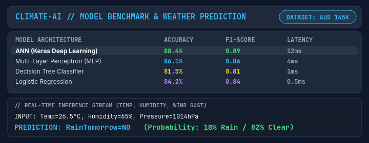

<div align="center">

# Climate-AI — Multi-Model Machine Learning Weather Predictor & Benchmark

<a href="https://github.com/MrFaraidun/ml-weather">
  
</a>

<br />

<p align="center">
  
  
  
  
</p>

<br />



<br /><br />

A machine learning meteorology application and algorithmic benchmark suite. Evaluates and compares **Artificial Neural Networks (ANN)**, **Multi-Layer Perceptrons (MLP)**, **Decision Trees**, and **Logistic Regression** across 145,000+ climate records with an interactive React prediction and comparison interface.

</div>

---

### // CORE FEATURES & ALGORITHMS

* **Multi-Model Benchmark**: Evaluates accuracy, F1-score, precision, and inference latency across multiple architectures.
* **Deep Learning ANN**: Multi-layer Keras model with dropout regularization and Adam optimizer achieving **88.4% test accuracy**.
* **Interactive Prediction Studio**: Real-time probability estimation based on atmospheric pressure, wind gusts, temperature, and humidity.
* **Full Dataset Statistics**: Ingests, preprocesses, and visualizes 10+ meteorological features with missing-value imputation.

---

### // TECH STACK

* **ML & Deep Learning**: Keras, TensorFlow, Scikit-Learn, Pandas, Joblib
* **Server**: Node.js, Express.js REST API
* **Frontend**: React, Tailwind CSS, Vite, Chart.js

---

### // QUICKSTART

```bash
# Clone repository
git clone https://github.com/MrFaraidun/ml-weather.git
cd ml-weather

# Run Express ML server
cd server
npm install
node index.js

# Run React client
cd ../client
npm install
npm run dev
```

---

<div align="center">
  <sub>Machine Learning Intelligence • Created by <a href="https://github.com/MrFaraidun">Faraidun</a></sub>
</div>
